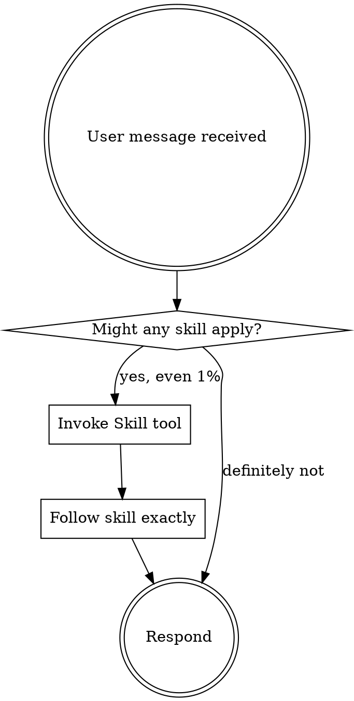

# Using Tessera + Superpowers

<!-- Top-level entry point documenting the Tessera-integrated Superpowers workflow -->

<EXTREMELY-IMPORTANT>
If you think there is even a 1% chance a skill might apply to what you are doing, you ABSOLUTELY MUST invoke the skill.

IF A SKILL APPLIES TO YOUR TASK, YOU DO NOT HAVE A CHOICE. YOU MUST USE IT.
</EXTREMELY-IMPORTANT>

## Instruction Priority

1. **User's explicit instructions** (CLAUDE.md, direct requests) — highest priority
2. **These skills** — override default system behavior
3. **Default system prompt** — lowest priority

## The Integrated Workflow

Tessera provides persistent codebase memory. Superpowers provides development methodology. Together:

```
brainstorming (graph_retrieve context)
  → writing-plans (graph_read + plan_save MCP tool)
    → Plannotator visual review (ExitPlanMode hook)
      → subagent-driven-development or executing-plans (graph_register_edit per edit)
        → requesting-code-review
          → verification-before-completion (tessera-verify)
            → finishing-a-development-branch (tessera-verify gate)
```

## Prerequisites

**Plannotator binary (for visual plan review):**
```bash
curl -fsSL https://plannotator.ai/install.sh | bash
```
Install once. Tessera's `ExitPlanMode` hook calls it automatically when you exit plan mode.

**Tessera MCP (for graph context in all skills):**
The tessera MCP server is registered via `.claude-plugin/.mcp.json`. Skills check "if tessera MCP is configured in this session" before calling graph tools — they gracefully degrade if tessera is not active.

## How to Use Skills

**In Claude Code:** Use the `Skill` tool. Read the skill's content and follow it directly.

**Never:** Use Read tool on skill files — use the Skill tool instead.

## Mandatory Skill Invocation Rules



## Skill Priority

1. **Process skills first** (`brainstorming`, `systematic-debugging`) — determine HOW to approach
2. **Implementation skills second** — guide execution

"Let's build X" → `brainstorming` first.
"Fix this bug" → `systematic-debugging` first.

## Red Flags

| Thought | Reality |
|---------|---------|
| "This is just a simple question" | Questions are tasks. Check for skills. |
| "I need more context first" | Skill check comes BEFORE clarifying questions. |
| "Let me explore the codebase first" | Skills tell you HOW to explore. Check first. |
| "I remember this skill" | Skills evolve. Read current version. |
| "The skill is overkill" | Simple things become complex. Use it. |

## Available Skills

| Skill | When |
|-------|------|
| `brainstorming` | Before any creative work or feature building |
| `writing-plans` | After design is approved, before touching code |
| `subagent-driven-development` | Executing plans with per-task subagents |
| `executing-plans` | Executing plans inline in current session |
| `test-driven-development` | Before writing any implementation code |
| `systematic-debugging` | Any bug, test failure, or unexpected behavior |
| `verification-before-completion` | Before claiming work is done |
| `requesting-code-review` | After tasks, before merging |
| `receiving-code-review` | When acting on review feedback |
| `using-git-worktrees` | Before starting feature work needing isolation |
| `dispatching-parallel-agents` | Multiple independent failures |
| `finishing-a-development-branch` | When implementation is complete |
| `writing-skills` | Creating or editing skills |
| `plan-review` | Independent GPT review of a written plan |
| `debate` | Multi-round Claude+GPT debate on an architecture question |
| `build` | Autonomous build loop with approval gates |
| `code-review` | Multi-model code review of current changes |
| `tessera-verify` | Compliance check: diff vs plan targets |
| `tessera-scan` | Rebuild Tessera's codebase graph |
